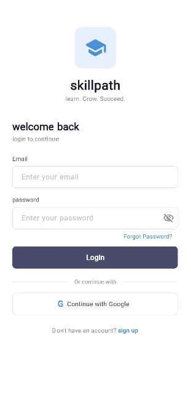
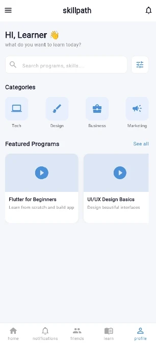
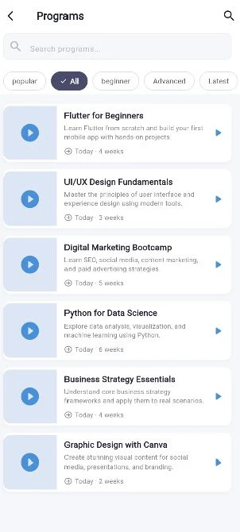

# SkillPath — Mobile Learning App


<p align="center">
  
  
  
  
</p>

---

## Vision

To make learning simple, accessible, and engaging by connecting users with educational programs, resources, and real-time updates — all in one platform.

---

## Objectives

| # | Objective |
|---|-----------|
| 1 | Cross-platform development (Android & iOS) using Flutter |
| 2 | User authentication (Email + Google Sign-In) |
| 3 | Program discovery with category filters |
| 4 | Progress tracking and completion certificates |
| 5 | Admin dashboard for content and user management |

---

## Navigation Flow

```
Login → Home → Program Listing → Program Detail → Enroll → Learner Dashboard
```

---

## Team

| Name | Role |
|------|------|
| Praise Esheya | Team Lead |
| Damian Amegashie | Project Manager |
| Ruth Nwosu | Project Scribe |
| Asma Shahzadi | Project Lead |
| Nanubala Sravani | UI/UX Designer |
| Anindya Roy | Team Member |
| Soumya Das | Team Member |
| Pratyush Srivastava | Team Member |

---

## Setup

```bash
# 1. Install Flutter SDK (>=3.0.0)
# 2. Clone this repo
git clone https://github.com/dwbstr/slu-0106-mad-team-2.git
cd slu-0106-mad-team-2

# 3. Get dependencies
flutter pub get

# 4. Run the app
flutter run
```

---

## Project Structure

```
lib/
├── main.dart                        # App entry point & theme
└── screens/
    ├── login_screen.dart            # Login screen with Google Sign-In
    ├── home_screen.dart             # Home with categories & featured programs
    ├── program_list_screen.dart     # Searchable & filterable program listing
    └── program_detail_screen.dart   # Program detail with tabs & enroll button
```

---

## Week 1 — Planning & Wireframes ✅

### App Proposal

**SkillPath** is a cross-platform mobile learning and program discovery app built with Flutter. It helps users explore educational programs, access learning resources, provide feedback, and stay updated through announcements and notifications.

### User Journeys

**Learner Journey**
1. Downloads app → creates account via email or Google
2. Browses programs → filters by category
3. Enrolls → accesses videos, PDFs, quizzes, and assignments
4. Tracks progress → completes lessons → receives certificate

**Admin Journey**
1. Logs into admin dashboard
2. Creates and manages programs (uploads content, resources)
3. Monitors learner activity and analytics
4. Sends announcements and push notifications
5. Reviews learner feedback to improve programs

### Wireframes Designed

| Screen | Status |
|--------|--------|
| Login Screen | ✅ |
| Home Screen | ✅ |
| Program Listing Screen | ✅ |
| Program Detail Screen | ✅ |

### Week 1 Deliverables

- ✅ App proposal documented
- ✅ Wireframes designed (Login, Home, Program Listing, Program Detail)
- ✅ GitHub repo initialized

---

## Week 2 — UI Screens Implementation ✅

### What Was Built

All four core screens were translated from wireframes into functional Flutter UI with navigation implemented between them.

---

### Screen 1 — Login Screen

**File:** `lib/screens/login_screen.dart`

**Features:**
- SkillPath logo and tagline
- Email and password text fields with input validation styling
- Password visibility toggle
- Forgot Password link
- Login button → navigates to Home Screen
- Google Sign-In button
- Sign Up link

<p align="center">
  
</p>

---

### Screen 2 — Home Screen

**File:** `lib/screens/home_screen.dart`

**Features:**
- Personalized greeting ("HI, Learner 👋")
- Search bar with filter icon
- Category icons: Tech, Design, Business, Marketing
- Horizontal scrollable featured program cards
- "See all" shortcut → navigates to Program Listing
- 5-tab bottom navigation bar (Home, Notifications, Friends, Learn, Profile)

<p align="center">
  
</p>

---

### Screen 3 — Program Listing Screen

**File:** `lib/screens/program_list_screen.dart`

**Features:**
- Search bar for program discovery
- Filter chips: Popular, All, Beginner, Advanced, Latest
- Scrollable program list with thumbnail, title, description, and duration
- Tap any program → navigates to Program Detail Screen
- Play arrow icon on each tile

<p align="center">
  
</p>

---

### Screen 4 — Program Detail Screen

**File:** `lib/screens/program_detail_screen.dart`

**Features:**
- Hero image with level badge (e.g., "Beginner friendly")
- Program title and star rating with review count
- Bookmark toggle in app bar
- Three tabs: **Overview**, **Instructor**, **Review**
  - Overview: description, duration, certification info
  - Instructor: profile card with bio
  - Review: learner reviews with star ratings
- Sticky "Enroll Now" button at bottom with snackbar confirmation

<p align="center">
  
</p>

---

### Navigation Map

```
LoginScreen
    └──(Login button)──► HomeScreen
                              └──(See all / Program card)──► ProgramListScreen
                                                                  └──(Program tile)──► ProgramDetailScreen
                                                                                            └──(Enroll Now)──► Snackbar ✅
```

### Design Choices

| Decision | Reason |
|----------|--------|
| Color: `#4A90D9` (blue) | Matches Excelerate/SkillPath learning brand |
| Color: `#4A4A6A` (dark) | Used for primary CTAs (Login, Enroll Now) for contrast |
| Bottom nav bar | Matches wireframe; enables quick access to all sections |
| Filter chips with checkmark | Clear visual feedback on active filter |
| `SingleChildScrollView` on Login | Prevents overflow on smaller screens |
| `TabBarView` fixed height | Prevents unbounded height error inside `SingleChildScrollView` |

### Week 2 Deliverables

- ✅ Login Screen implemented in Flutter
- ✅ Home Screen with categories, search, and program cards
- ✅ Program Listing Screen with filter chips and search
- ✅ Program Detail Screen with tabs and Enroll button
- ✅ Navigation implemented: Login → Home → Programs → Detail
- ✅ Branding applied consistently across all screens
- ✅ GitHub repository updated with latest code

---

## Week 3 — Data Fetching, Forms & Refactoring ✅

### What Was Built
We integrated sample JSON data to dynamically populate our program list, simulating real API calls. We refactored the app architecture to use a clean `models` and `services` structure, and introduced interactive forms with robust input validation.

### Deliverables
- ✅ **API Integration:** Created `assets/programs.json` and a `ProgramService` to fetch dynamic program data asynchronously using `rootBundle`.
- ✅ **Registration Form:** Built `RegistrationScreen` with proper form validation (valid email format, minimum password length, etc.) using `TextFormField` and `DropdownButtonFormField`.
- ✅ **Feedback Form:** Added a functional feedback/rating form on the `ProgramDetailScreen`.
- ✅ **Search Option:** Implemented search functionality to allow learners to easily find specific programs.
- ✅ **App Architecture:** Refactored the app structure into `models/` and `services/` for better code maintainability.

### Screens Added

#### Screen 5 — Registration Screen
Contains form validation to ensure users enter valid details before enrolling in a program.
<p align="center">
  
</p>

#### Screen 6 — Feedback Form (Program Detail)
Allows learners to leave reviews and feedback on specific courses.
<p align="center">
  
</p>

### 📱 App Demo

Watch the complete application demo here:

[SLU 0106 MAD TEAM - 2 - WEEK 3 Demo Video ](https://docs.google.com/videos/d/1LmWKiPiNnZnhel9AMARc43IV1NWjaGR8j0BbJCRJR8k/edit?usp=sharing)


### State Management & User Experience
- ✅ Used Flutter's `setState()` for managing loading, success, and error states.
- ✅ Displayed `CircularProgressIndicator` while fetching program data to show loading states.
- ✅ Implemented `try-catch` error handling for JSON loading failures, displaying user-friendly error messages instead of crashing.

### Files Added & Modified
- `assets/programs.json` (New data source)
- `lib/models/program.dart` (New data model)
- `lib/services/program_service.dart` (New API service)
- `lib/screens/registration_screen.dart` (New screen)
- Modified `program_list_screen.dart` to connect JSON data
- Modified `program_detail_screen.dart` to add the feedback form
---

## Roadmap

| Week | Focus | Status |
|------|-------|--------|
| Week 1 | Planning, wireframes, repo setup | ✅ Done |
| Week 2 | Core UI screens + navigation | ✅ Done |
| Week 3 | Backend integration, real data, auth | ✅ Done |
| Week 4 | Dashboard, progress tracking, polish | 🔜 Upcoming |

---

# Team2-Excelerate SLU 0106 MAD - WEEK 3
